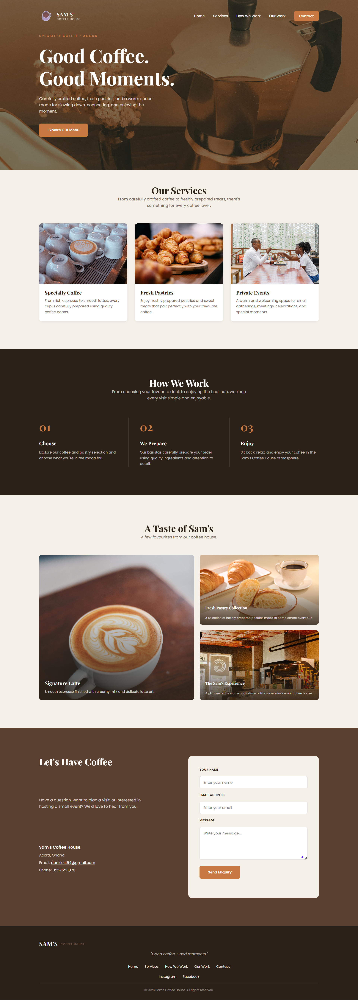
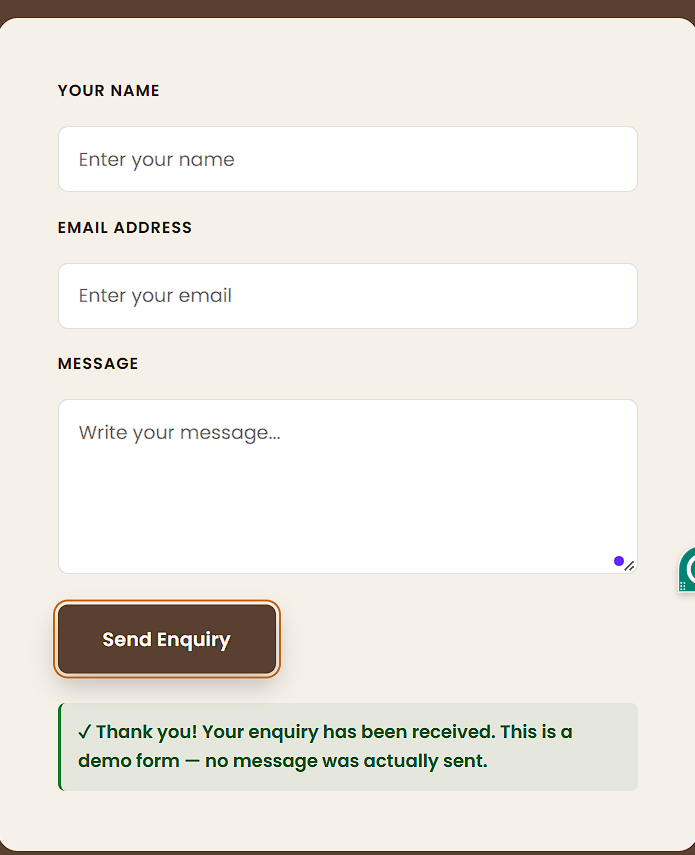

# Sam's Coffee House

A single-page landing page for a fictional specialty coffee shop, built as an individual capstone project for the Frontend Development Essentials course.

## Project Information

| | |
|---|---|
| **Project name** | Sam's Coffee House |
| **Industry** | Specialty Coffee Shop |
| **Location** | Accra, Ghana |
| **Project type** | Local Business Landing Page |
| **Technology** | HTML5, CSS3, Vanilla JavaScript |

**Purpose:** A premium, warm, editorial-style landing page for a fictional specialty coffee shop in Accra. The page is designed to introduce the business, showcase its services and recent work, explain how it works, and allow visitors to submit an enquiry.

> Sam's Coffee House is a fictional business created for this capstone assignment. All content is for demonstration purposes only.

## Target Audience

- Students
- Young professionals
- Creatives
- Coffee lovers
- People looking for a welcoming place to meet, relax, or enjoy coffee

## Project Goal

The main goal is to create a visually appealing and easy-to-use local business website that encourages visitors to explore the coffee house and make an enquiry.

## Features

- Structured navigation between all page sections
- Hero section with a clear call-to-action
- Our Services section
- How We Work section
- Recent Work image gallery
- Contact / enquiry form
- Footer navigation
- Accessible form labels
- Descriptive image alt text
- Keyboard focus states
- JavaScript form validation
- Demo success message after a valid form submission

## JavaScript Interaction: Contact Form Validation

The contact form (`#contact-form`) is validated entirely with plain JavaScript in `script.js`. On submit, the script:

1. Prevents the default form submission (no page reload).
2. Checks that the **name** field is filled in.
3. Checks that the **email** field is filled in and matches a valid email format.
4. Checks that the **message** field is filled in.
5. Displays clear validation feedback inside `#form-message` if any check fails.
6. Displays a friendly **demo** confirmation message once all fields are valid.
7. Resets the form fields after a successful submission.

**Important:** This form does not send data to a backend or any real email service — it is a frontend-only demo. The success message clearly states this to the user, since the project has no server-side component.

## Design Direction

The visual direction for the page is:

- Modern
- Warm
- Premium
- Editorial
- Welcoming

This is expressed through:

- Cream / off-white backgrounds
- Dark brown typography
- Warm coffee tones
- A terracotta/orange accent color
- Large, full-bleed photography
- Generous whitespace
- **Playfair Display** for headings
- **Poppins** for body text and navigation

## Design Research / Inspiration

**Inspiration:** "Critter – Coffee Shop Landing Page"
**Source:** https://dribbble.com/shots/25161039-Critter-Coffee-Shop-Landing-Page

**Sections influenced:**
- Hero
- Our Services
- Recent Work
- CTA / contact presentation

**What was adapted:**
- Full-width hero photography
- Warm visual palette
- Large editorial typography
- Image-based service/work cards
- Spacious layout
- Strong call-to-action presentation

This design was used purely as **visual inspiration** for direction, composition, and mood. It was not copied directly — Sam's Coffee House has its own layout, content, brand mark, and color identity.

### Image Credits

Image sources will be documented here when applicable.

## Build Process

1. Planned the business concept and target audience.
2. Researched visual inspiration.
3. Created the semantic HTML structure.
4. Developed the visual design using CSS.
5. Added and connected the image assets.
6. Implemented JavaScript contact-form validation.
7. Tested navigation, images, form validation, accessibility, and layout.
8. Performed a final quality-assurance review.

## Testing

**Navigation**

| Link | Result |
|---|---|
| Home | Passed |
| Services | Passed |
| How We Work | Passed |
| Our Work | Passed |
| Contact | Passed |
| "Explore Our Menu" CTA | Passed |

**Contact form**

| Test | Result |
|---|---|
| Empty name validation | Passed |
| Empty email validation | Passed |
| Invalid email validation | Passed |
| Empty message validation | Passed |
| Valid form submission | Passed |
| Demo success message | Passed |

**Images**

| Test | Result |
|---|---|
| All required image files load correctly | Passed |

**Accessibility**

| Test | Result |
|---|---|
| Form labels | Passed |
| Image alt text | Passed |
| Keyboard focus states | Passed |
| Text contrast | Passed |

**Browser / layout**

| Test | Result |
|---|---|
| Desktop/laptop layout tested | Passed |

## Known Limitations

- The contact form is frontend-only and does not send real enquiries.
- The Instagram and Facebook footer links are placeholders, since this fictional business has no real social media accounts.
- Mobile responsiveness has not yet been implemented — the layout is currently built and tested for desktop/laptop widths only.

## Contact

- **Email:** dadzies154@gmail.com
- **Phone:** 0557553878
- **Location:** Accra, Ghana

## Reflection

Working on Sam's Coffee House helped me build practical, hands-on skills in:

- Writing semantic, accessible HTML
- Structuring layouts and visual design with CSS
- Validating forms with plain JavaScript
- Applying accessibility practices (labels, alt text, focus states, contrast)
- Sourcing and integrating image assets
- Researching design inspiration and adapting it into an original identity
- Testing and debugging a full page end-to-end

**One improvement for a future version:** adding mobile responsiveness so the layout adapts properly to smaller screens.

## Project Structure

```
sam-coffee-house/
├── index.html
├── style.css
├── script.js
├── images/
├── moodboard/
└── README.md
```

## Run Locally

1. Clone or download this project.
2. Open the project folder.
3. Open `index.html` directly in a browser.

Alternatively, the project can be served with any simple local development server (for example, the VS Code "Live Server" extension), though this is not required since the project has no build step or dependencies.

## Screenshots

**Full Website** — Complete desktop view of Sam's Coffee House landing page.



**Contact Form Validation** — Demonstration of the JavaScript form validation and success message.



## Submission Links

- **GitHub Repository:** [Add GitHub repository link here]
- **Live Demo:** [Add live demo link here]
